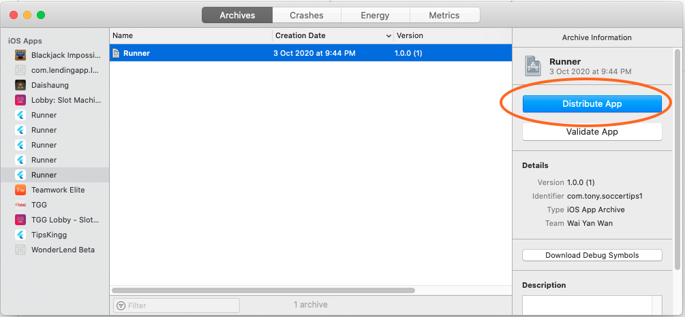
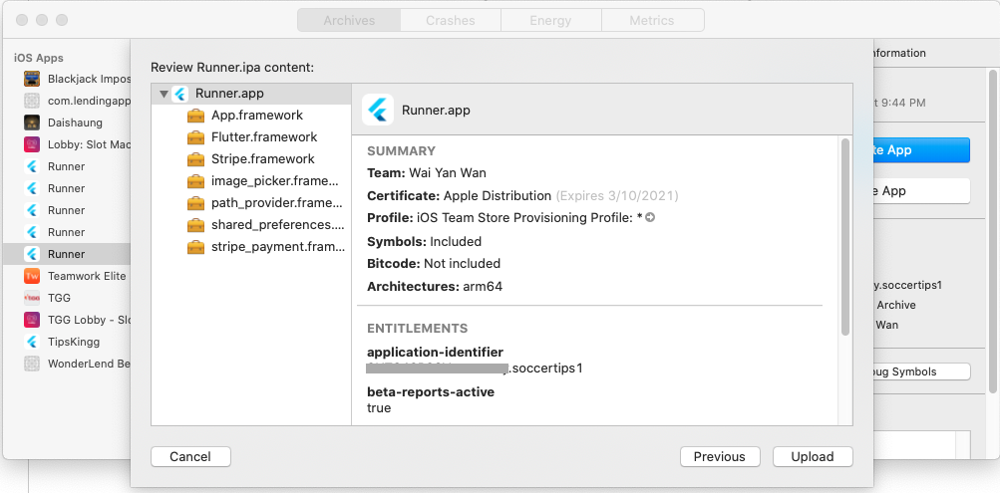

# ScoreApp TestFlight

## Manual

1. In Terminal, Git pull Flutter project

2. In VS Code,

   a. Check ios/Podfile, use this line

   ```
   platform :ios, '12.0'
   ```

   

   b. Check ios/Flutter/AppFrameworkInfo.plist, use 12.0 for MinimumOSVersion

   ```
   <key>MinimumOSVersion</key>
   <string>12.0</string>
   ```

   

3. In Terminal,

   ```shell
   cd ios
   pod install
   ```

   

4. In Browser, login https://developer.apple.com/

   Click Account

   

   

   Click Certificates, Identifiers & Profiles

   

   

   Click (+)

   

   

   Select App IDs > Continue

   

   

   Select App > Continue

   

   

   Fill in Description > Choose Explicit for Bundle ID > Fill in explicit ID > Tick needed Capabilities > Continue

   

   

   Click Register

   

5. In browser, login https://appstoreconnect.apple.com/

   Click My Apps

   

   

   Click (+) > Choose New App

   

   Tick iOS > Fill in Name > Choose Primary Language > Choose the Bundle ID just  created > Fill in SKU > Choose Full Access for User Access > Click Create

   

6. In Finder, double click /ios/Runner.xcworkspace

   In Xcode, 

   a. Click File>Workspace Settings>Choose "Legacy Build System" for "Build System"> Done

   

   

   

   b. On left side, click Runner Project> click Runner under TARGETS> click General tab

   c. In Identity, Fill in Bundle Identifier with Bundle ID just created before

   d. In Deployment Info, choose Target iOS version

   

   

   e. Click Signing & Capabilities, choose Team with correct Apple Developer Account> Bundle Identifier should be already same as what you have filled > show no error

   For app name, click "Info" tab and edit value of "Bundle name" then hit enter.

   

   f. Check Xcode Run

      Connect iphone to macbook by USB / open simulator

   ​	Choose Device to deploy

   

   Click Run > should show build succeeded

7. In Xcode, Click Product on top > Archive > wait until it finishes loading > should show build succeeded > Click Distribiute App>Choose App Store Connect>Next>Choose Upload>Next>Tick Strip Swift symbols and tick Upload your app's symbols..... >Upload>Done

   

   

   Click Distribiute App

   

   

   Choose App Store Connect > Next

   

   

   Choose Upload > Next

   

   

   Tick Strip Swift symbols and tick Upload your app's symbols..... > Next

   

​		

​		Choose Automatically manage signing > Next


Click Upload



8. In browser, in App Store Connect, 

   a. Click My Apps > click my newly created app > Click TestFlight > Click Test Information on the left(A yellow question mark should appear next to it) > Fill in Beta App Description, Feedback Email, Marketing URL, Privacy Policy URL, First Name, Last Name, Phone number, Email, Review Notes and License Agreement > no need to tick Sign-in required > Save > the yellow question mark should disappear


b. Click iOS on the left > click Manage behind "Missing Compliance" > Choose No for the encryption question > Click Start Internal Testing

c. If apple users were not added, click **Users and Access** on top > (+)> Fill in info> Invite > Wait apple user accept through email

d. Click App Store Connect Users on the left > (+) > tick users > Add


## Reference

https://www.youtube.com/watch?v=MFD4snJfBaw&feature=emb_rel_pause


## Appendix

To be able to build successfully in Xcode, app icon png in /Assets folder must be non Alpha. To verify this, please double click the .png to open the png picture. Then, choose File > Export. Then uncheck this Alpha box and save the png in same place.


Then under ScoreApp path, run these 3 commands

```bash
flutter clean

flutter pub get

flutter pub run flutter_launcher_icons:main
```

Then run the app with command

```bash
flutter run
```

